theme: Olive Green , 9

# [fit] Power of **Ensembles**
### ______

<br>

**Amit Kapoor** 
[@amitkaps](https://twitter.com/amitkaps)

**Bargava Subramanian** 
[@bargava](https://twitter.com/bargava)

---

# **The Blind Men & the Elephant**
## ___

“And so these men of Indostan
Disputed loud and long,
Each in his own opinion
Exceeding stiff and strong,
Though each was partly in the right,
And all were in the wrong.”
— *John Godfrey Saxe*

---

# **Model Abstraction**
## ___

"All models are wrong, but some are useful"
*— George Box*

---

# **Building Many Models**
## ___

"All models are wrong, ~~but~~ some are useful, **and their combination may be better**"

---

# **Ensembles**
### ___

(noun) /änˈsämbəl/
*a group of items viewed as a whole rather than individually.*

---

# **Machine Learning Process**
### ___

**Frame**: Problem definition
**Acquire**: Data ingestion 
**Refine**: Data wrangling
**Transform**: Feature creation 
**Explore**: Feature selection 
**Model**: Model selection
**Insight**: Solution communication 

---

# **Machine Learning Model Pipeline**
### ___

```
 Data   ---   Feature   ---   Model   ---   Model
 Space         Space        Algorithm     Parameters
  (n)           (f)            (m)           (p)
```

---


# **Machine Learning Challenge**
### ___

*"...the task of searching through a hypotheses space to find a suitable hypothesis that will make good predictions for a particular problem"*

---

# **Hypotheses Space**
### ___

```
 Data   ---   Feature   ---   Model   ---   Model
 Space         Space        Algorithm     Parameters
  (n)           (f)            (m)           (p)

                          |_________________________|
                                Hypotheses Space
                          
```

---

# **Search Hypotheses Space**
### ___ 

The key question is how do we efficiently search this *Hypotheses Space*?

---

# **Illustrative Example**
### ___

**Binary Classification Problem**

*Classes:* `c = 2`
*Features:* `f = x1, x2, x3`
*Observations:* `n = 1,000`

---

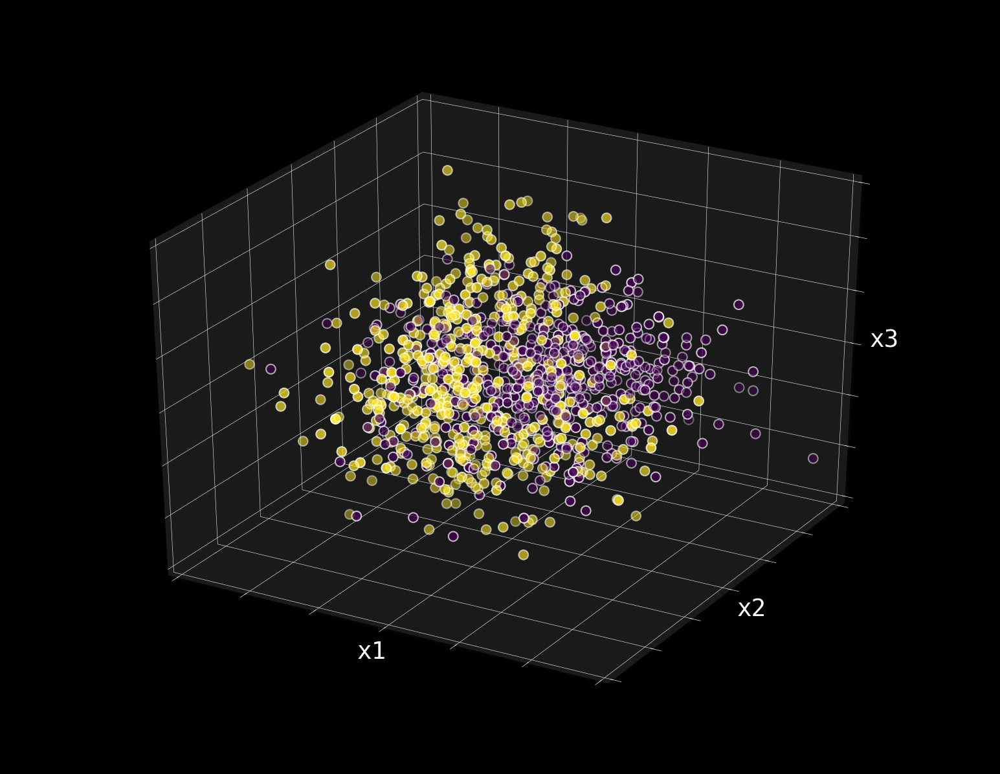

---

# **Dimensionality Reduction**
### ___

> "Easier to visualise the data space"

Principal Component Analysis
Dimensions = 2 --> (pc1, pc2)


---

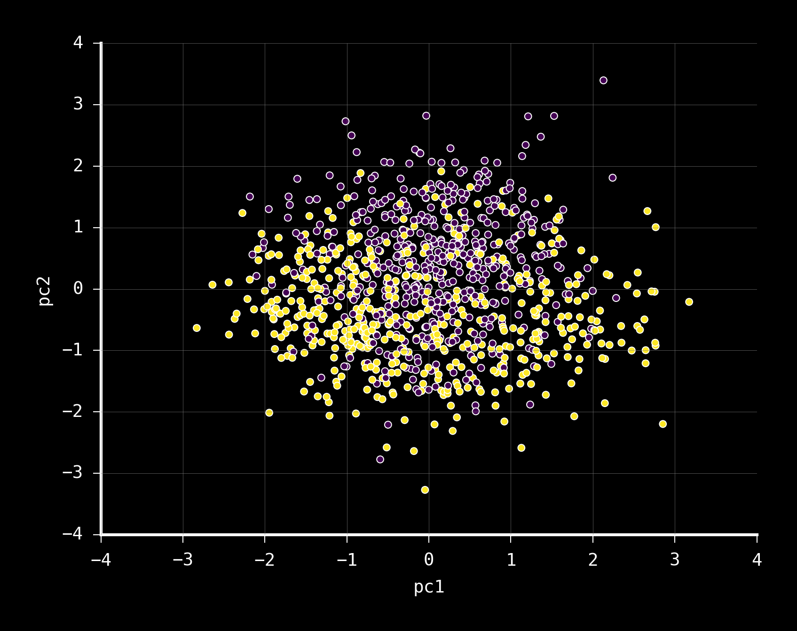

---

# **Approach to Build Models**
### ___

1. Train a **model**
2. Predict the **probabilities** for each class
3. Score the model on **AUC** via **5-Fold Cross-Validation**
4. Show the **Decision Space**


---

# **Simple Model with Different Features**
### ___

```
 Data   ---   Feature   ---   Model   ---   Model
 Space         Space        Algorithm     Parameters
  (n)           (f)            (m)           (p)

 100%           x1,x2        Logistic         C=1
 100%           x2,x3        Logistic         C=1
 100%           x1,x3        Logistic         C=1
 100%           pc1,pc2      Logistic         C=1

```

---

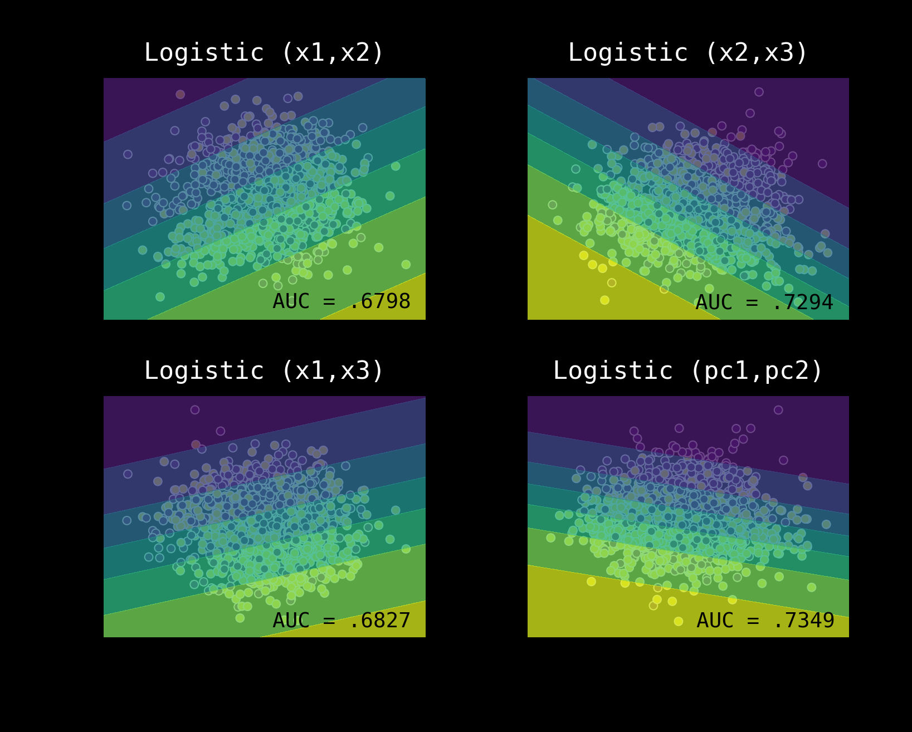


---

# **Tune the Model Parameters**
### ___

```
 Data   ---   Feature   ---   Model   ---   Model
 Space         Space        Algorithm     Parameters
  (n)           (f)            (m)           (p)

100%          pc1,pc2        Logistic       C=1
100%          pc1,pc2        Logistic       C=1e-1
100%          pc1,pc2        Logistic       C=1e-3
100%          pc1,pc2        Logistic       C=1e-5

```


---

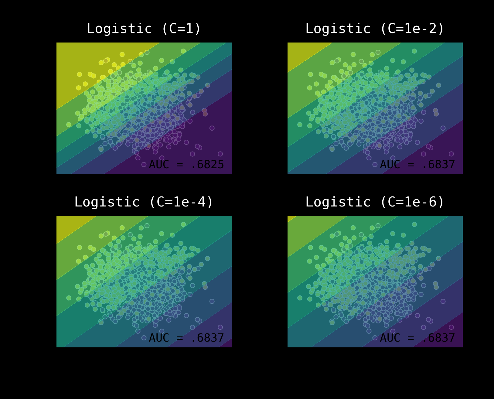

---

# **Make Many Simple Models**
### ___

```
 Data   ---   Feature   ---   Model   ---   Model
 Space         Space        Algorithm     Parameters
  (n)           (f)            (m)           (p)

 100%         pc1,pc2        Logistic         C=1
 100%         pc1,pc2        SVM-Linear       prob=True
 100%         pc1,pc2        Decision Tree    d=full
 100%         pc1,pc2        KNN              nn=3

```
---


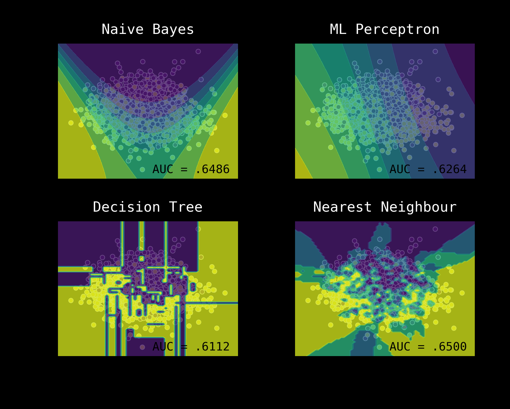

---

# **Hypotheses Search Approach**
### ___

**Exhaustive search** is impossible
**Compute** as a proxy for human IQ
**Clever algorithmic** way to search the solution space

---

# **Ensemble Thought Process**
### ___

"The goal of ensemble methods is to combine the predictions of several base estimators built with (one or multiple) model algorithms in order to improve generalisation and robustness over a single estimator."

---

# **Ensemble Approach**
### ___

Different **training sets**
Different **feature sampling**
Different **algorithms**
Different **(hyper) parameters**

Clever **aggregation**

---

# **Ensemble Methods**
### ___

[1] Averaging
[2] Boosting
[3] Voting
[4] Stacking

---

# **[1] Averaging: Concept**
### ___

"Build several estimators independently and then average their predictions to reduce model variance"
      
*To ensemble several good models to produce a less variance model.*

---

**[1] Averaging: Approaches**
### 
 
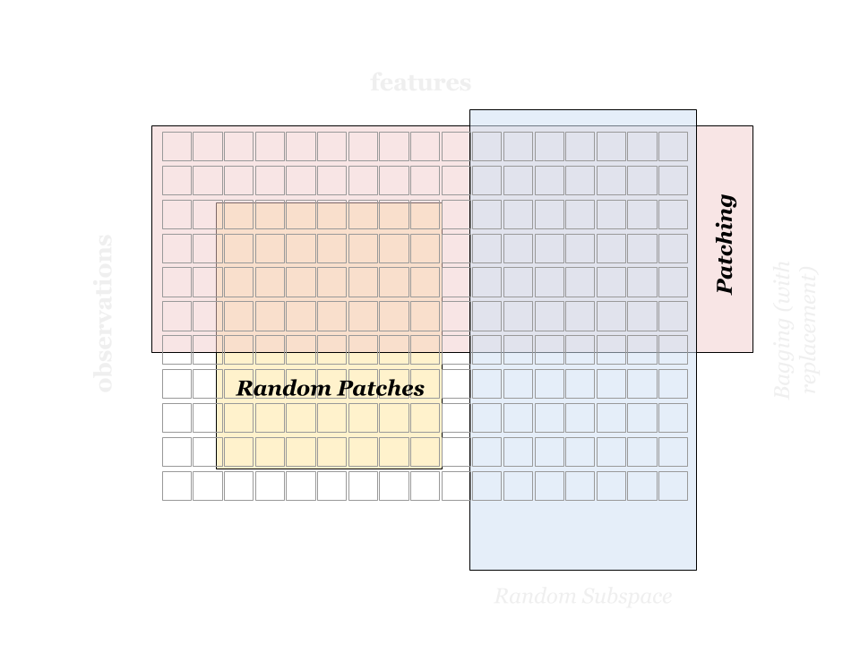

---

# **[1] Averaging: Simple Models**
### ___

```
 Data   ---   Feature   ---   Model   ---   Model
 Space         Space        Algorithm     Parameters
  (n)           (f)            (m)           (p)

R[50%]       pc1,pc2      Decision Tree    n_est=10
R[50%,r]     pc1,pc2      Decision Tree    n_est=10
100%         R[50%]       Decision Tree    n_est=10
R[50%]       R[50%]       Decision Tree    n_est=10

```

---

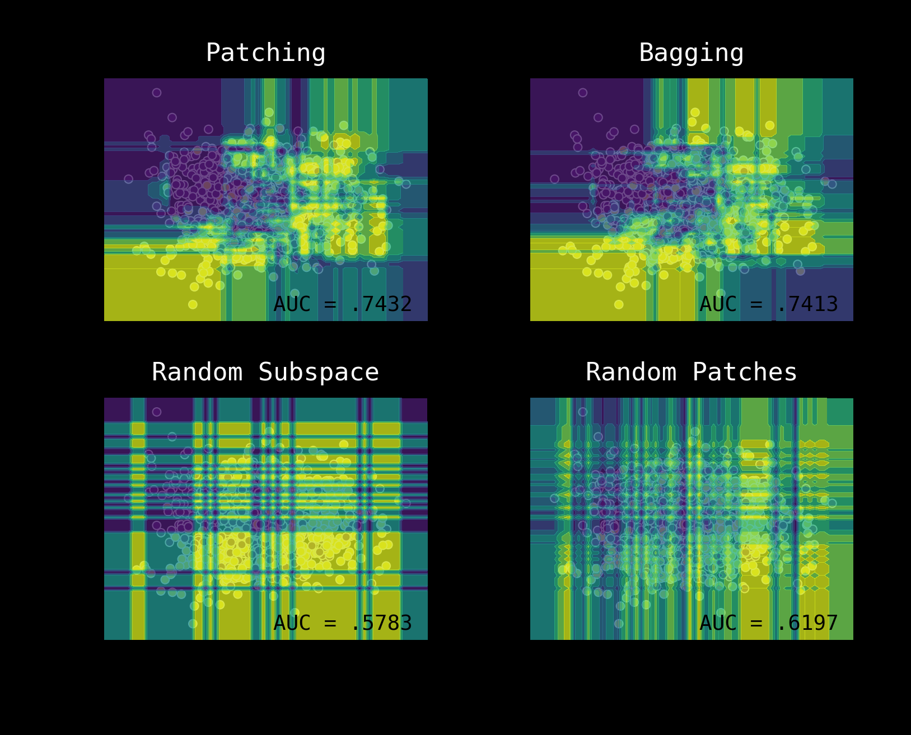

---

# **[1] Averaging: Extended Models**
### ___

Use *perturb-and-combine techniques* 

**Bagging**: Bootstrap Aggregation 
  
**Random Forest**: Best split amongst random features
   
**Extremely Randomised**: Random threshold for split 

---

# **[1] Averaging: Extended Models**
### ___

```
 Data   ---   Feature   ---   Model   ---   Model
 Space         Space        Algorithm     Parameters
  (n)           (f)            (m)           (p)

100%         pc1,pc2      Decision Tree    d=full
R[50%,r]     pc1,pc2      Decision Tree    n_est=10
R[50%,r]     R[Split]     Decision Tree    n_est=10
R[50%,r]  R[Split,thresh] Decision Tree    n_est=10

```

---


---

# **[2] Boosting: Concept**
### ___

"Build base estimators sequentially and then try to reduce the bias of the combined estimator." 

*Combine several weak models to produce a powerful ensemble.*

---

**[2] Boosting: Concept**
### ___

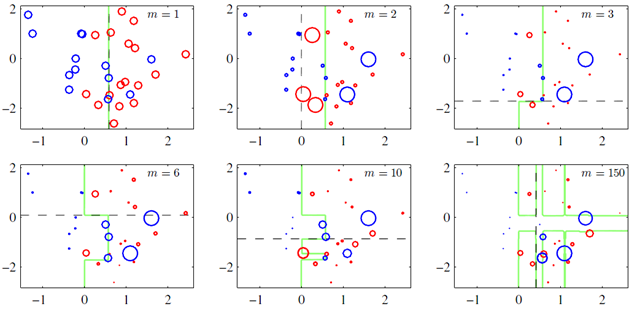
###    
###   
###    
###   
###   
###   
###   
### Source: Wang Tan


---

# **[2] Boosting: Models**
### ___

```
 Data   ---   Feature   ---   Model   ---   Model
 Space         Space        Algorithm     Parameters
  (n)           (f)            (m)           (p)

 100%         pc1,pc2      Decision Tree    d=full
 100%         pc1,pc2      DTree Boost      n_est=10
 100%         pc1,pc2      DTree Boost      n_est=10, d=1
 100%         pc1,pc2      DTree Boost      n_est=10, d=2

```

---


---

# **[3] Voting: Concept**
### ___

"To use conceptually different model algorithms and use majority vote or soft vote (average probabilities) to combine."

*To ensemble a set of equally well performing models in order to balance out their individual weaknesses.*

---

**[3] Voting: Approach**
###   
   
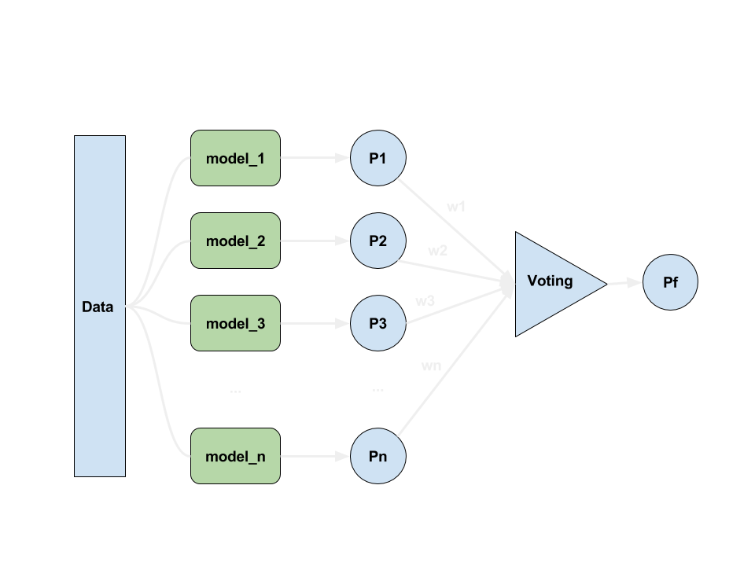

---

# **[3] Voting: Approach**
### ___

**Hard** Voting: *the majority (mode) of the class labels predicted*

**Soft** Voting: *the argmax of the sum of predicted probabilities*

**Weighted** Voting: *the argmax of the weighted sum of predicted probabilities**

---

# **[3] Voting: Models**
### ___

```
 Data   ---   Feature   ---   Model   ---   Model
 Space         Space        Algorithm     Parameters
  (n)           (f)            (m)           (p)

 100%         pc1,pc2       Gaussian         -
 100%         pc1,pc2       SVM - RBF        gamma=0.5, C=1
 100%         pc1,pc2       Gradient Boost   n_est=10, d=2
 -----        -------       --------------   --------------
 100%         pc1,pc2       Voting           Soft

```

---

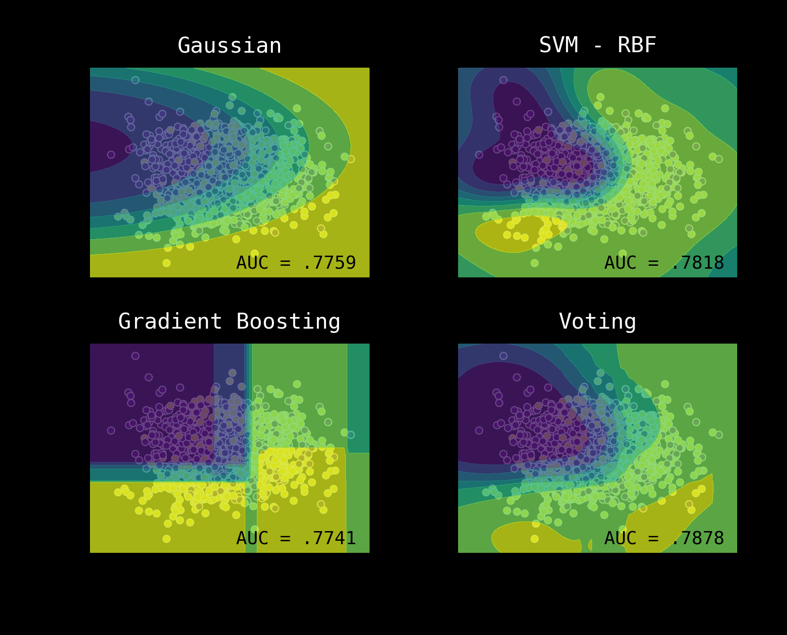

---

# **[4] Stacking**
### ___

"To use output of different model algorithms as feature inputs for a meta classifier."

*To ensemble a set of well performing models in order to uncover higher order interaction effects*

---

**[4] Stacking: Approach**
### 

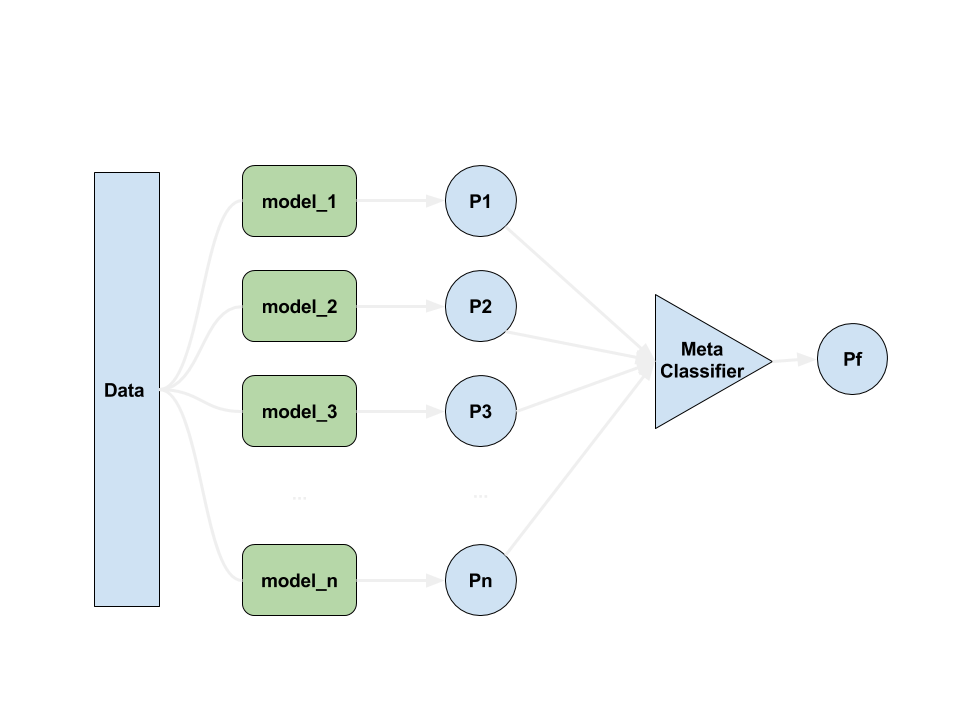

---

# **[4] Stacking: Models**
### ___

```
 Data   ---   Feature   ---   Model   ---   Model
 Space         Space        Algorithm     Parameters
  (n)           (f)            (m)           (p)

 100%         pc1,pc2       Gaussian         -
 100%         pc1,pc2       SVM - RBF        gamma=0.5, C=1
 100%         pc1,pc2       Gradient Boost   n_est=10, d=2
 -----        -------       --------------   --------------
 100%         pc1,pc2       Stacking         Logistic()

```

---

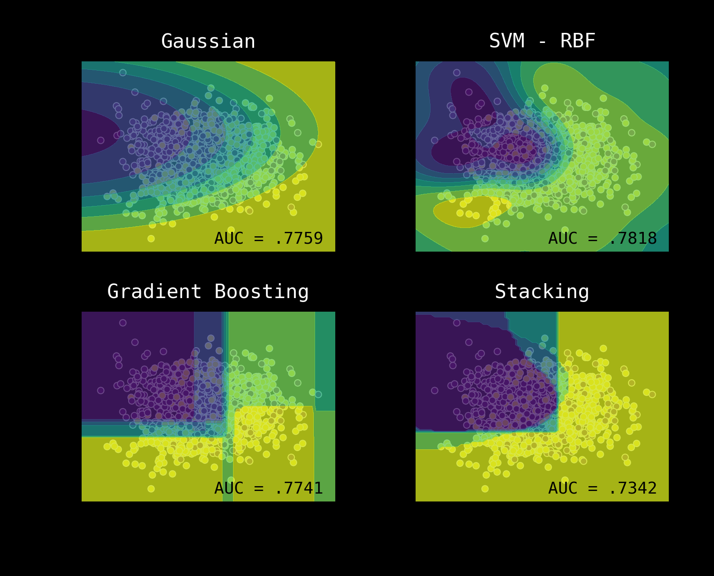

---
# **Ensemble Advantages**
### ___

Improved **accuracy**
**Robustness** and better **generalisation**
**Parallelization**

---

# **Ensemble Disadvantages**
### ___

Model human **readability** isn't great
**Time/effort trade-off** to improve accuracy may not make sense

---

#  **Advanced Ensemble Approach**
### ___

- *Grid Search* for voting weights
- *Bayesian Optimization* for weights & hyper-parameters
- *Feature Engineering* e.g. tree or cluster embedding

---

# **Ensembles**
### ___

*"It is the harmony of the diverse parts, their symmetry, their happy balance; in a word it is all that introduces order, all that gives unity, that permits us to see clearly and to comprehend at once both the ensemble and the details."*
- **Henri Poincare**

---

# **Code and Slides**
### ____

All the code and slides are available at [https://github.com/amitkaps/ensemble](https://github.com/amitkaps/ensemble)

---

# **Contact**
### ______

**Amit Kapoor** 
[@amitkaps](https://twitter.com/amitkaps)
[amitkaps.com](http://amitkaps.com)

**Bargava Subramanian** 
[@bargava](https://twitter.com/bargava)
