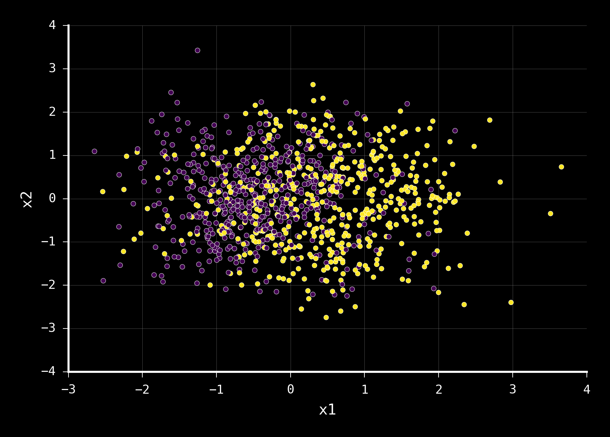
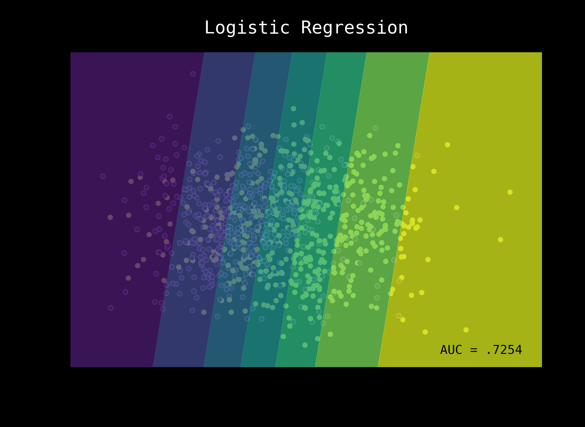
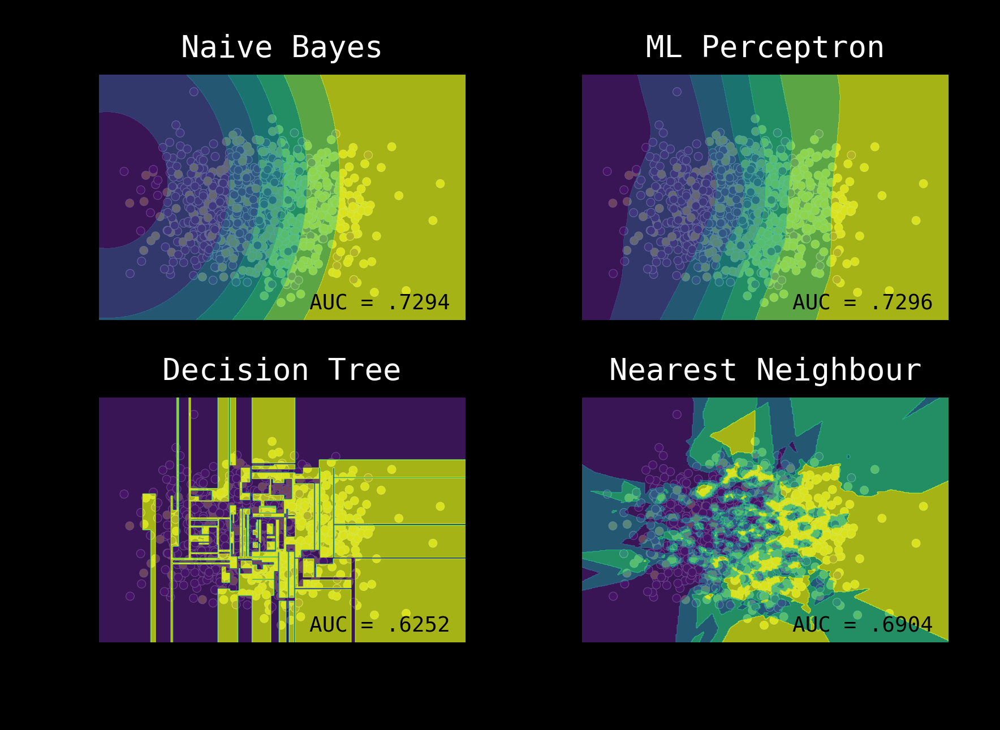

theme: Olive Green , 1

# [fit] Power of **Ensembles**
### ______

<br>

**Amit Kapoor** 
[@amitkaps](https://twitter.com/amitkaps)

**Bargava Subramanian** 
[@bargava](https://twitter.com/bargava)

---

# Ensembles
### ___

*"It is the harmony of the diverse parts, their symmetry, their happy balance; in a word it is all that introduces order, all that gives unity, that permits us to see clearly and to comprehend at once both the ensemble and the details."*
- **Henri Poincare**


---

# Machine Learning **Process**
### ___

**Frame**: Problem definition
**Acquire**: Data ingestion 
**Refine**: Data wrangling
**Transform**: Feature creation 
**Explore**: Feature selection 
**Model**: Model selection & evaluation
**Insight**: Communication 

---

# Machine Learning
### ___

Process

---

# Machine Learning
### ___

```
Dataset -- Features --  Model    --  Model
                       Algorithm    Parameters
```

---

# Take an example
### ___

**Binary Classification**
**Two Features** - `x1` and `x2`
`n = 10,000`

---



---

# Start with a simple model
### ___

Model = **Logistic Regression**
  
Predict the **Probabilities** for each class
Generate a **Cross-Validation** score
Show the **Decision Space**


---



---

# Make Many Simple Models
### ___

Models = {
**Naive Bayes** Classifier,
Multi Layer **Perceptron**,
**Decision Tree** Classifier,
**Logistic** Regression,
}

---



---

#[fit] Features? Models?


---

#[fit] **Two critical Steps**

<br>
**Features**
<br>
**Model**

--- 

##[fit] Your model is only as good
##[fit]  **as you and your features**

---
#[fit] **A lot of time is spent on**
<br>

**Feature identification**
<br>
**Feature creation**
<br>
**Feature generation**


---
<br>
##[fit] Different models with same features 
##[fit] mostly result in **different predictions**
<br>


---


##[fit] Different models with same features 
##[fit] mostly result in different predictions
<br>
#[fit] **Why?**

---

## The models searched **different** regions of the **solution space**

---

> Improve model performance

**given features**

---


> Different models
<br>
> Hyperparameters
<br>
**Number of features**

---

# [fit] Possible Solution Approach?

---

#[fit] Exhaustive search **infeasible**

---


# [fit] Ensemble models are our **friends**

---

# [fit] What are **ensembles**?

---

# `Logistic Regression`

```python

from sklearn import linear_model

# build a classifier
model = linear_model.LogisticRegression()
model.fit(train)
```
---

# `Random Forest`

```python

from sklearn.ensemble import RandomForestClassifier

# build a classifier
model = RandomForestClassifier()
model.fit(train)

```

---

# `Gradient Boosting Machines`

```python

import xgboost as xgb

# build a classifier
# define the parameters and train matrix
model = xgb.train(parameters, dtrain)
```

---


---


---

# [fit] **CPU** as a proxy for human IQ

---


## Clever Algorithmic way to search the solution space

---

# But is it **new**?

---


#[fit] Known to researchers/academia for long.
#[fit] Wasn't widely used in industry until....

---


# Success Story

> Netflix $ 1 million prize competition

---

![inline] (ensemble-3.png)

---

# **Some Advantages**

**Improved accuracy**
<br>
**Robustness**
<br>
**Parallelization**

---

![left fit] (ensemble-3.png)


### Base model **diversity**
### Model **aggregation**

---

# **Base Model**

**Different training sets**
**Feature sampling**
**Different algorithms**
**Different Hyperparameters**

---

# **Model Aggregation**

**Voting**
**Averaging**
**Blending**
**Stacking**

---

![fit] (ensemble-4.png)

---


![fit] (ensemble-5.png)

---

# `RandomizedSearchCV`

``` python

from scipy.stats import randint as sp_randint
 
from sklearn.grid_search import GridSearchCV, RandomizedSearchCV
# build a classifier
clf = RandomForestClassifier(n_estimators=20)
# specify parameters and distributions to sample from
param_dist = {"max_depth": [3, None],
              "max_features": sp_randint(1, 11),
              "min_samples_split": sp_randint(1, 11),
              "min_samples_leaf": sp_randint(1, 11),
              "bootstrap": [True, False],
              "criterion": ["gini", "entropy”]}
# run randomized search
n_iter_search = 20
random_search = RandomizedSearchCV(clf, param_distributions=param_dist,
                                  n_iter=n_iter_search)

```
---

#  **`hyperopt`**


### Python library for serial and parallel optimization over awkward search spaces, which may include real-valued, discrete, and conditional dimensions.

https://github.com/hyperopt/hyperopt

---
# **`hyperopt`**

``` python
# define an objective function
def objective(args):
# Define the objective function here

# define a search space
from hyperopt import hp
space = hp.choice('a',
    [
        ('Model 1', randomForestModel),
        ('Model 2', xgboostModel)
    ])

# minimize the objective over the space
from hyperopt import fmin, tpe
best = fmin(objective, space, algo=tpe.suggest, max_evals=100)

```
---

# **`joblib`**

transparent disk-caching of the output values and lazy re-evaluation (memoize pattern)
<br>
easy simple parallel computing
<br>
logging and tracing of the execution

---

# `joblib`

```python

import pandas as pd
from sklearn.externals import joblib
 
# build a classifier
train = pd.read_csv('train.csv')
clf = RandomForestClassifier(n_estimators=20)
clf.fit(train)
 
# once the classifier is built we can store it as a synchronized object
# and can load it later and use it to predict, thereby reducing memory footprint.
 
joblib.dump(clf, 'randomforest_20estimator.pkl')
clf = joblib.load('randomforest_20estimator.pkl')

```

---

#[fit] **Ensembles**
### Secret to winning a Kaggle competition

---

#[fit] Kaggle Competition: Crowdflower Search Results Relevance 
#[fit][https://www.kaggle.com/c/crowdflower-search-relevance](https://www.kaggle.com/c/crowdflower-search-relevance)


#[fit][https://github.com/ChenglongChen/Kaggle_CrowdFlower](https://github.com/ChenglongChen/Kaggle_CrowdFlower)
---


# Disadvantages 

Model human readability isn't great
<br>
Time/Effort trade-off to improve accuracy may not make sense

---


#[fit] **Package pushed to PyPI @ EuroPython 2016**

#[fit] [https://github.com/unnati-xyz/ensemble-package](https://github.com/unnati-xyz/ensemble-package)

<br>
*Team: Prajwal Kailas, Amit Kapoor, Bargava Subramanian, Nischal HP, Raghotham Sripadraj*

---


#[fit] Questions ? 
